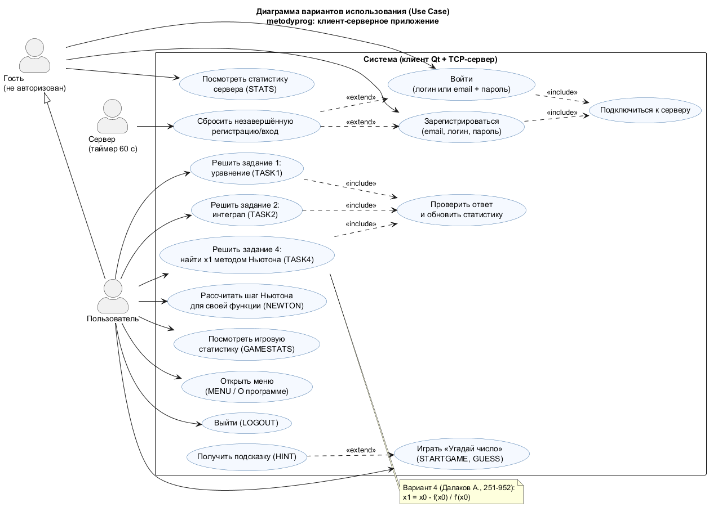
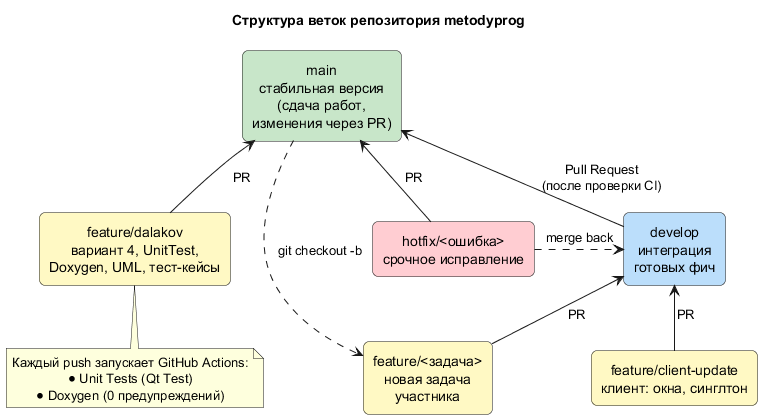
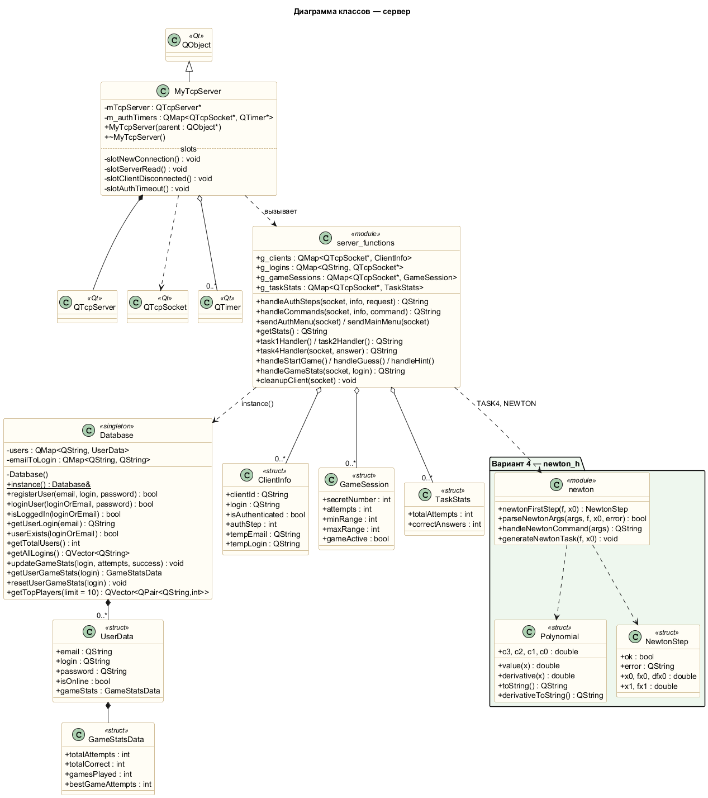
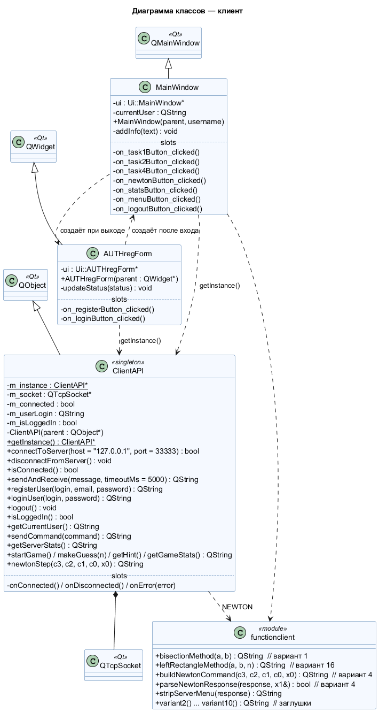

# metodyprog — клиент-серверное приложение на Qt

[](https://github.com/121007timur-ctrl/metodyprog/actions/workflows/tests.yml)
[](https://github.com/121007timur-ctrl/metodyprog/actions/workflows/doxygen.yml)

Учебный проект по дисциплине ТИМП (группа 251-952).
TCP-сервер на Qt обслуживает несколько клиентов одновременно: регистрация и вход,
задания по численным методам (варианты участников), игра «Угадай число», статистика.
Клиент — оконное приложение Qt Widgets.

| Часть | Папка | Сборка |
|-------|-------|--------|
| Сервер | [`server/`](server) | `server/server.pro` (Qt Core + Network) |
| Клиент | [`client/`](client) | `client/client.pro` (Qt Widgets + Network) |
| Юнит-тесты | [`tests/`](tests) | `tests/tests.pro` (Qt Test) |
| Документация | [`docs/`](docs) | `doxygen Doxyfile` |

## Быстрый старт

1. Открыть `server/server.pro` в Qt Creator → Run. Сервер слушает порт **33333**.
2. Открыть `client/client.pro` → Run. Откроется окно авторизации.
3. Зарегистрироваться, войти, выбрать задание.

Проверить сервер можно и без клиента: `telnet 127.0.0.1 33333` (или PuTTY, режим Raw).

## Протокол (команды сервера)

| Команда | Кто может | Что делает |
|---------|-----------|------------|
| `REGISTER` | гость | регистрация: далее email, логин, пароль |
| `LOGIN` | гость | вход: далее логин **или** email, пароль |
| `STATS` | все | статистика сервера |
| `TASK1` / `TASK2` | пользователь | уравнение / интеграл |
| `TASK4` | пользователь | **вариант 4:** найти x1 методом Ньютона |
| `NEWTON c3 c2 c1 c0 x0` | пользователь | **вариант 4:** шаг Ньютона для f(x) = c3x³ + c2x² + c1x + c0 |
| `STARTGAME`, `GUESS n`, `HINT`, `GAMESTATS` | пользователь | игра «Угадай число» |
| `MENU`, `LOGOUT` | пользователь | меню, выход |

## Вариант 4 — метод Ньютона (Далаков Аслан)

Задание: *«Дано: функция, её производная, начальное приближение x₀. Найти: первое приближение x₁ методом Ньютона.»*

$$x_1 = x_0 - \frac{f(x_0)}{f'(x_0)}$$

- **Сервер** — [`server/newton.h`](server/newton.h): многочлен до 3-й степени, производная, шаг
  Ньютона с проверкой f′(x₀) = 0; команды `NEWTON` (калькулятор) и `TASK4` (случайное задание,
  проверка ответа с точностью 0.01, учёт в статистике).
- **Клиент** — кнопки **«Вариант 4: Ньютон»** (ввод c3…c0, x0) и **«Задание 4 (Ньютон)»**;
  `ClientAPI::newtonStep()`, `buildNewtonCommand()` / `parseNewtonResponse()` в
  [`client/functionclient.h`](client/functionclient.h).

Пример:
```
> NEWTON 1 0 -2 -5 2
f(x)  = x^3 - 2x - 5
f'(x) = 3x^2 - 2
x0 = 2,  f(x0) = -1,  f'(x0) = 10
x1 = x0 - f(x0)/f'(x0) = 2.1
NEWTON OK x1=2.1
```

## UML

| Use Case | Структура веток Git |
|----------|---------------------|
|  |  |

**Диаграмма классов — сервер**



**Диаграмма классов — клиент**



Исходники диаграмм (PlantUML): [`docs/uml/`](docs/uml).

## Тестирование

- Юнит-тесты (Qt Test, 43 теста, запускаются в CI): [`tests/`](tests/README.md)
- Тест-кейсы и дефекты варианта 4 и смежного функционала (Далаков Аслан):
  [docs/testing/test_cases_defects_dalakov.xlsx](docs/testing/test_cases_defects_dalakov.xlsx)
- Тест-кейс и дефект клиента (Насыров Тимур): [client/test_case/test_case_client.xlsx](client/test_case/test_case_client.xlsx)
- Тест-кейс и дефект сервера (Чистяков Аким): [server/server_registration_db_test_case.xlsx](server/server_registration_db_test_case.xlsx)
- Тест-план: [test-plan.md](test-plan.md), чек-лист: [test-cases/checklist.md](test-cases/checklist.md)

## Документация (Doxygen)

```
doxygen Doxyfile      # → docs/html/index.html
```

В GitHub Actions документация собирается на каждый push (сборка падает при любом
предупреждении Doxygen), HTML доступен как артефакт `doxygen-docs`, а из `main`
публикуется в ветку `gh-pages`.

## Git

Схема веток и правила работы — в [Wiki: Структура Git](https://github.com/121007timur-ctrl/metodyprog/wiki/Структура‐Git).
Кратко: `main` — стабильная версия, `develop` — интеграция, `feature/<задача>` — работа
участника, слияние только через Pull Request с зелёным CI.

## Команда

| Участник | Задачи |
|----------|--------|
| Чистяков Аким | сервер, БД в синглтоне, несколько клиентов, тест-кейс сервера |
| Насыров Тимур | клиент в синглтоне, оконный интерфейс, Docker, тест-кейс клиента |
| Далаков Аслан | Wiki, структура Git, диаграммы классов, Use Case, Doxygen, вариант 4 (метод Ньютона), UnitTest, тест-кейсы и дефекты |
